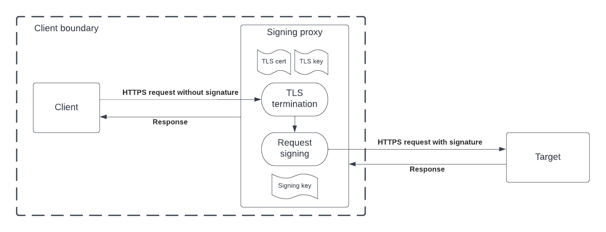

# HTTPS signing proxy

- [Introduction](#introduction)
- [Run the proxy](#run-the-proxy)
- [Configuration](#configuration)
  - [Configuration override](#configuration-override)
    - [Using flags](#override-config-using---set-flag)
    - [Using env var](#override-config-using-env-var)
- [Proxy mechanism](#proxy-mechanism)
- [Metrics](#metrics)

## Introduction

The request signing proxy would sit in front of the client and intercept outbound requests, sign them with client's
private key and transfer signed requests to the server. It uses the request signing library [here](https://github.com/form3tech-oss/go-http-message-signatures).



More about request signing [here](https://api-docs.form3.tech/tutorial-request-signing.html).

## Run the proxy

The proxy requires `--config` flag, which point to the config file. See [configuration](#configuration) section below.

```shell
./signing-proxy --config <config_file_path>
```

In [example directory](./example), there are several files which help running the proxy locally:

- [config_example.yaml](./example/config_example.yaml): A complete config file that should be in `--config` flag.
- [cert.crt](./example/cert.crt): A self-signed certificate for an HTTPS proxy (TLS mode only).
- [private.key](./example/private.key): The private key associated with the certificate above (TLS mode only).
- [rsa_private_key.pem](./example/rsa_private_key.pem): A private key that is used to sign incoming request.
- [rsa_public_key.pub](./example/rsa_public_key.pub): The public key associated with the private key above. It is not 
  used by the proxy but will be useful if you need to verify the signature.
- [docker-compose.yaml](./example/docker-compose.yaml): A convenient docker compose file that runs the proxy with all 
  the config above. The proxy serves HTTPS requests at port 8080.

## Configuration

```yaml
# HTTP server config
server:
  # Listening port
  port: 8080
  # If SSL is used, the proxy will receive https request from downstream, terminate it, sign it then establish a new
  # https connection to upstream
  ssl:
    enable: true
    # Location of the proxy's certificate, if SSL is enabled  
    certFilePath: "/etc/ssl/certs/cert.crt"
    # Location of the proxy's private key, if SSL is enabled
    keyFilePath: "/etc/ssl/private/private.key"

# Request forward proxy config
proxy:
  # URL where the proxy should forward the request to. It can be a server or another proxy.
  upstreamTarget: "https://api.form3.tech/v1"
  # Request signing config
  signer:
    # The key id stored on remote server that maps to the public key
    keyId: "27781930-f2d0-463e-b6cf-0ed0ec0d8dd9"
    # Location of the private key which will be used to sign requests
    keyFilePath: "/etc/form3/private/private.key"
    # The algorithm used to create a digest for body content, can be either SHA-256 or SHA-512
    bodyDigestAlgo: "SHA-256"
    # The algorithm used to hash the signature, can be either SHA-256 or SHA-512
    signatureHashAlgo: "SHA-256"
    # Signature headers config
    headers:
      # For POST, PUT and PATCH request, whether a digest header should be included.
      includeDigest: true
      # Whether a special (request-target) header should be included.
      includeRequestTarget: true
      # List of headers to create signature from, only those which present in the request will be added. 
      # However, at least one must be specified in the request. 
      # For example, a GET request does not have content-length header, 
      # so the proxy will not include content-length to the signature.
      signatureHeaders:
        - host
        - date
        - content-length

# Log config
log:
  # Log level
  level: info
  # Log format, can be either 'text' or 'json'
  format: json
```

### Configuration override

One can override any `string` field (list field override is not supported) with `--set` flag or environment variable.

#### Override config using `--set` flag

To override specific fields, `--set key=value` flag can be set multiple times.
For example, `proxy.signer.keyId` and `log.level` in the yaml file above can be overridden by:

```shell
./signing-proxy --config <config_file_path> \
  --set proxy.signer.keyid=5099392e-3040-40f9-ac70-ce66a9ee0ed6 \
  --set log.level=debug
```

#### Override config using env var

A `a.b.c` field can be automatically overridden by setting a `A_B_C` env var
(all capitalised and dots replaced by underscore).
For example, `proxy.signer.keyId` and `proxy.signer.bodyDigestAlgo` in the yaml file above can be overridden by:

```shell
export PROXY_SIGNER_KEYID=5099392e-3040-40f9-ac70-ce66a9ee0ed6
export PROXY_SIGNER_BODYDIGESTALGO=SHA-512
```

## Proxy mechanism

Any request coming in the proxy will be signed and forwarded to the upstream target, meaning the host will be replaced
by the target host and a signature header will be added, the rest of the request is kept as-is. If the request fails 
the signing validation (due to missing headers for example), the request will not be proxied and the server will return 
a `400 - Bad Request` response to the client.

The upstream target can be another proxy. In that case, `HTTP_PROXY`, `HTTPS_PROXY` and `NO_PROXY` environment variables 
can be explicitly set.

Additionally, there are two endpoints explicitly exposed by the proxy:

- `GET /-/health` for health check.
- `GET /-/prometheus` for metrics.

Incoming requests like above will not be signed nor forwarded to the upstream target.

## Metrics

The proxy publishes certain metrics under `GET /-/prometheus` endpoint:

|        Metric name         |   Type    | Description                                                                        |
|:--------------------------:|:---------:|------------------------------------------------------------------------------------|
| total_internal_error_count |  Counter  | Total number of the proxy's internal errors. Upstream errors do not count.         |
|    total_request_count     |  Counter  | Total number of requests coming to the proxy.                                      |
| total_signed_request_count |  Counter  | Total number of incoming requests that have been signed and proxied.               |
|  signing_duration_seconds  | Histogram | Request signing duration time in seconds.                                          |
|  request_duration_seconds  | Histogram | Total request duration time in seconds, including signing and upstream processing. |
